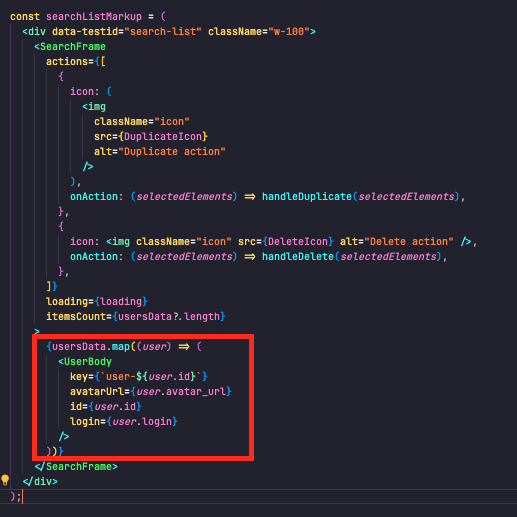
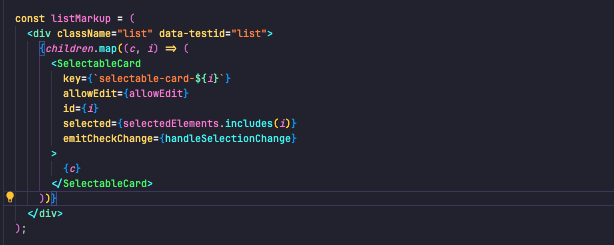

# Documentation technique Github user search

- [Introduction](#introduction)
- [Hooks](#hooks)
  - [useSearch](#useSearch)
  - [useDebounce](#useDebounce)
- [Page](#page)
  - [liste d'utilisateurs](#liste-d-utilisateurs)
- [Composants](#composants)
  - [SearchInput](#searchInput)
  - [SearchFrame](#searchFrame)
  - [SelectableCard](#selectableCard)
- [Conclusion](#conclusion)

## Introduction

Cette documentation vise à expliquer et justifier les choix techniques que je considère pertinents pour le test technique frontend **Github user search**.

Il y aura trois sections distincts: Hooks, Pages et Composants.

## Hooks

### useSearch

fichier: `src/hooks/useSearch/useSearch.hook.ts`

Le hook useSearch pour but d'éxécuter la requête de recherche et de retourner trois variables: **data**, **error** et **loading**.

Mettre la logique de requête de recherche dans Hook permet:

- De généraliser une fonction qui sera surement utilisée plusieurs fois dans le projet
- D'externaliser la logique de requête de recherche des composants, ce qui se traduit par des composants plus concis, davantage axés sur leurs responsabilités principales
- De se conformer à ce qui se fait actuellement avec les clients front, que ce soit en rest avec des outils comme **react-query** ou en graphql avec **apollo client**.

Après un certain temps de réflexion, j'ai pris la décision de faire un hook spécifique pour les requêtes de recherche **useSearch**. (j'hésitais avec un hook plus général pour gérer toutes les requêtes de lecture de type **useFetch**). Mais après quelques essaies je me suis rendu compte que les requêtes de recherches de l'api Github renvoie une erreur sur la query vide, du coup j'ai préféré faire un hook spécifique à la recherche.

le hook useSearch permettait par rapport au hook useFetch:

- De ne pas considérer les requêtes dont la query est nulle, ce qui permet de ne pas avoir a traité ce cas d'erreur coté front. Notament l'erreur lorsqu'on arrive sur la page avec le champs de recherche vide.
- De ne pas dégrader l'expérience utilisateur dès l'arrivée sur la page avec une erreur de type "query vide"

### useDebounce

fichier: `src/hooks/useDebounce/useDebounce.hook.ts`

Le hook useDebounce est conçu pour retarder l'initialisation d'une variable d'état jusqu'à ce qu'un certain délai soit écoulé. J'ai choisi de l'utiliser dans le champ de recherche pour réduire la charge sur l'API.
En externalisant cette fonctionnalité dans un hook, je peux créer une variable d'état tout en reconnaissant son utilité dans d'autres contextes qu'un simple champs de recherche.

## Page

### Liste d'utilisateur

fichier: `src/pages/UserSearchList/UserSearchList.tsx`

La seule page du test technique est la page de liste d'utilisateurs avec un champs de recherche.

J'ai décidé d'apeller mon hook de recherche dans cette page, et également de mettre le composant de champs de recherche et le composant de liste que nous verrons par la suite.

Comme on peut voir sur la capture ci-dessous:

J'ai décidé de mettre les spécificités des affichages liés aux utilisateurs dans la Page. On voit sur la capture d'écran que j'utilise la composition React pour encapsuler un composant spécifique aux utilisateurs (**UserBody**).

Ceci a pour objectif d'externaliser la logique spécifique aux utilisateur du composant de liste(**SearchFrame**). Car je voulais faire un composant de liste général, qui soit utilisable pour tout type d'entité.

## Composants

### SearchInput

fichier: `src/components/SearchInput/SearchInput.tsx`

J'ai décidé de faire un composant spécifique pour le champs de recherche, le composant prend en charge le retardement des mise à jour de la query de recherche (en utilisant le hook **useDebounce**) et permet également d'émmetre la valeur du champs à son parent.

J'ai créé un composant dédié pour cette fonctionnalité, car je crois qu'il peut être utilisé de manière polyvalente pour plusieurs cas d'utilisation.

J'ai également choisi de l'intégrer directement dans le composant de la page. Bien que j'aurais pu l'ajouter au composant de la liste (**SearchFrame**) que nous explorerons plus tard, j'ai estimé que cette approche aurait limité la flexibilité de la liste (je pense notamment à pouvoir utiliser la liste dans un autre cadre que de la recheche).
De plus, l'événement émis par le composant de recherche aurait dû remonter deux niveaux pour atteindre la page, ce qui aurait compliqué la gestion des données.

### SearchFrame

fichier: `src/components/SearchFrame/SearchFrame.tsx`

J'ai décidé de faire un composant de liste généraliste, qui n'embarque pas de spécificité d'entité métier(user dans notre cas)

Pour ce faire:

- les cartes spécifiques aux users proviennent de la propriété children, comme on a pu le voir sur la capture d'écran dans la partie Page.
- les actions proviennent de la propriété actions qui est optionnel.

ces choix permettent au composant **SearchFrame** de pouvoir gérer tout autre entité que des users.

Par exemple, imaginons que nous souhaitions créer une liste de recherche pour l'entité **Topic** de l'API GitHub. Dans ce cas, aucune modification du composant "SearchFrame" ne serait nécessaire. Il suffirait simplement d'intégrer le composant de **TopicCard** dans la propriété children du composant "SearchFrame" et d'embarquer ce dernier dans la page de liste de "Topic".

Le fait de mettre les actions sous forme de propriété, permet au composant **SearchFrame** de gagner en flexibilité, car on aurait très bien pu imaginer des actions différentes selon les liste.

Comme vous le constaterez, ce composant offre la possibilité de basculer entre le mode lecture et le mode édition, tout en gérant les cas de recherche vide et en cours.

### SelectableCard

fichier: `src/components/SelectableCard/SelectableCard.tsx`

J'ai décidé de faire un composant permettant de sélectionner une carte, celui est embarqué dans **SearchFrame**,
comme vous pouvez le voir dans la capture ci-dessous:

on peut également voir que les enfants de la propriété children sont enfait embarqué dans le composant **SelectableCard**, qui est lui même embarqué dans **SearchFrame**

Le fait d'avoir externaliser ce composant permet:

- De rendre le composant **SearchFrame** plus concis
- De rendre la fonctionnalité de sélection plus évolutive (imaginons qu'on veuille remplacer les cartes de sélection par des lignes, il n'y a qu'à modifier le composant SelectableCard)

## Conclusion

Voici les détails techniques que je pensais être pertinents, j'espère avoir été assez clair dans mes explications.
